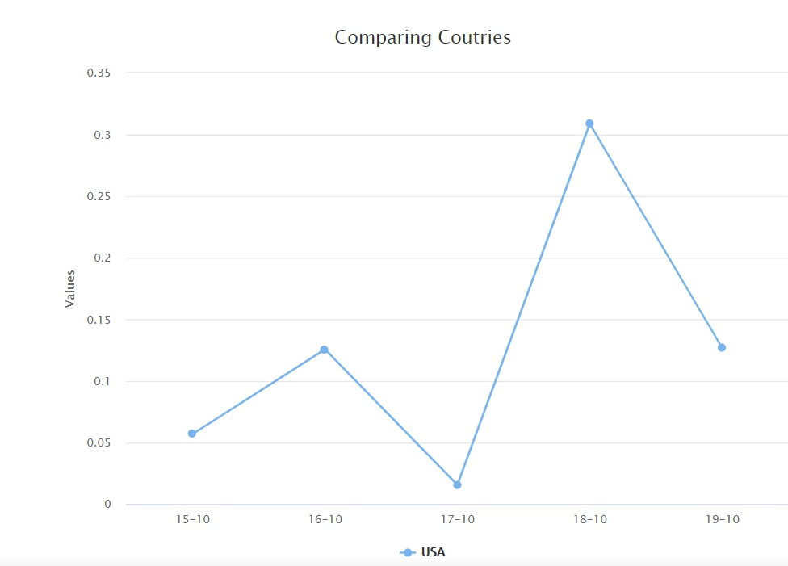
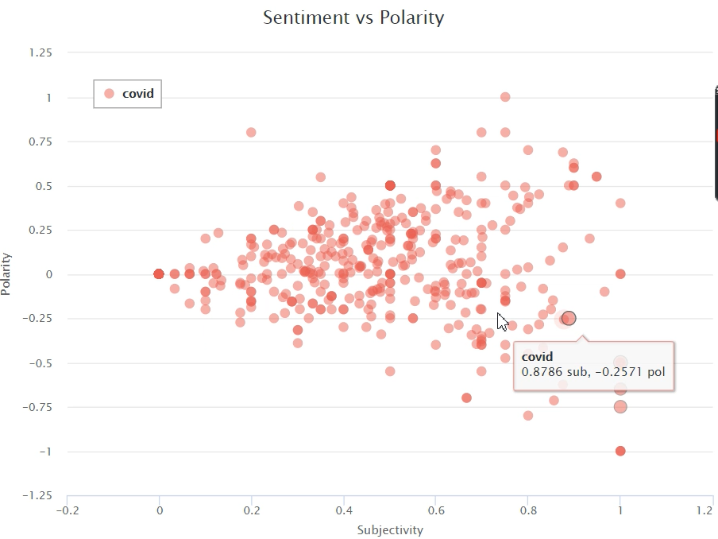
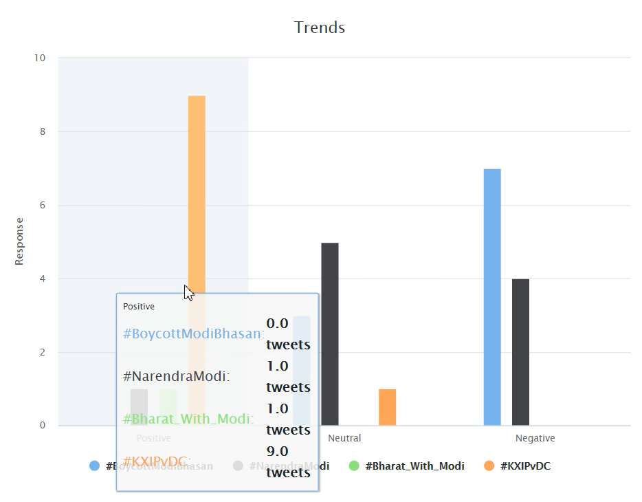
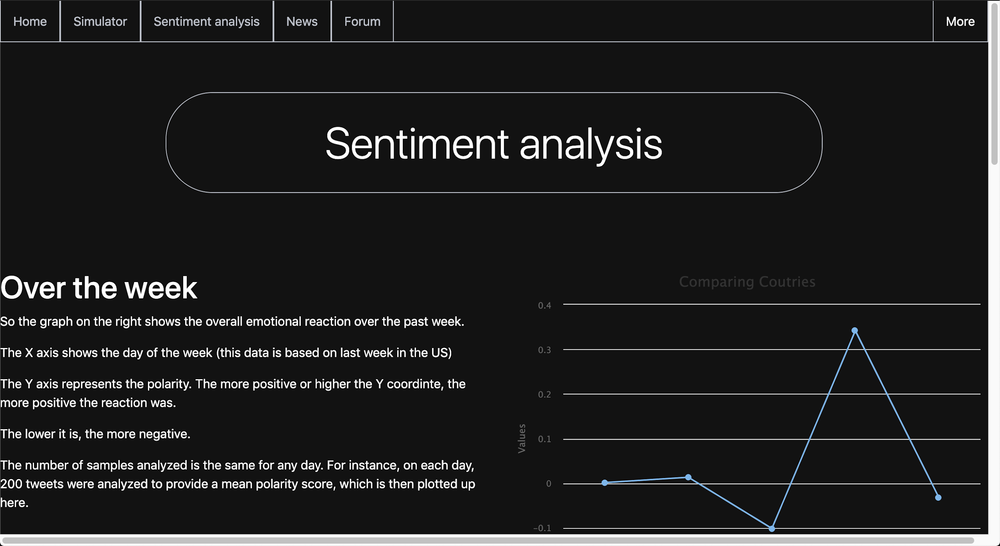
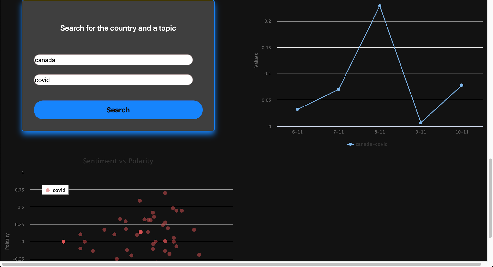

# Sentiment Analysis
## NLP on Tweets

This was a module developed for a larger project. Given a country and the topic, the page shows how people (well mainly Twitter users) local to the region are reacting to it. There are also additional information like "Top trending topics" of the region and subjectivity vs sentiment scatterplots.

The file to be run is home.py (inside the folder named: flask). Flask required.

## Output

The graph shows the timeline (spanning a week) and how people "feel" about it on different days, or how sentiment varies during the week on a specific topic (the picture shows the topic COVID in USA)

The scatterplot shows how opinionated the tweets are (X-Axis) and how the sentiment varies (Y-axis). As subjectivity lowers (more factual), sentiment tends to be neutral because, well, they're facts.

This shows the other top trending topics grouped into classes of positive, negative and neutral tweets.

The graphs are explained and so are the ways to interpret or use the search bar.

This is the search bar where users can enter the topic to analyze and the region to sample tweets from. Thus, in a way, we can know what people anywhere in the world, feel about anything! (So much power...)

**Note**: Some features or modules may not work properly straight from download as they need API keys. I have kept mine hidden but you can generate keys for yourself quite easily.